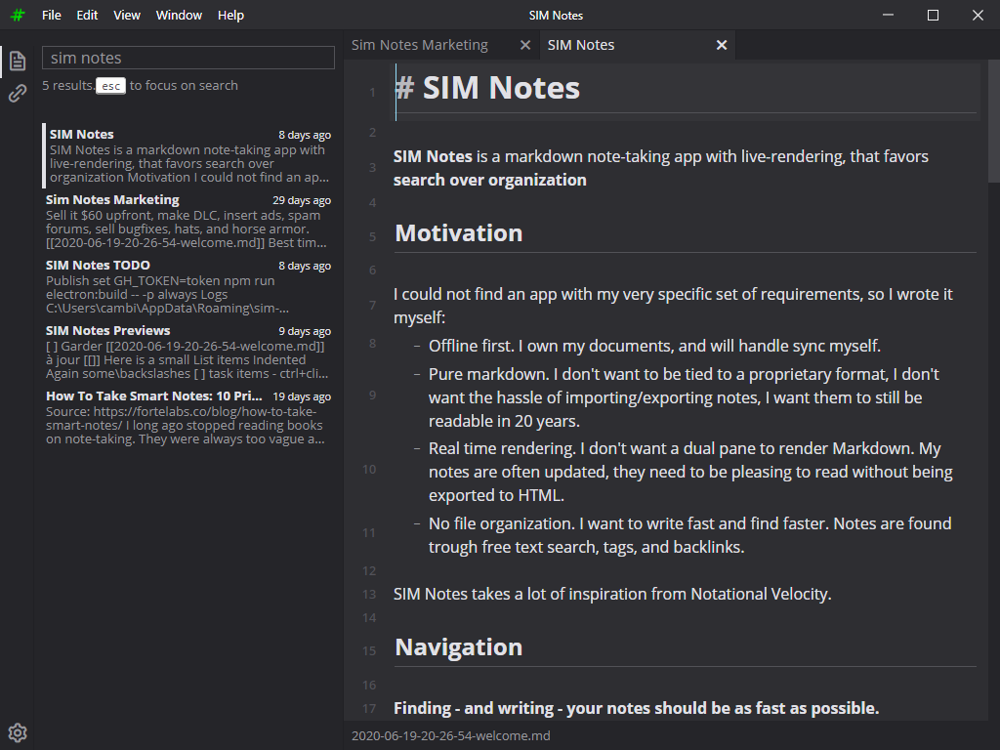

**[Downloads](https://github.com/scambier/SIM-Notes/releases)**

# SIM Notes

**SIM Notes** is a markdown note-taking app with live-rendering, that favors **search over organization**

## Motivation

I could not find an app with my very specific set of requirements, so I wrote it myself:
- Offline first. I own my documents, and will handle sync myself.
- Pure markdown. I don't want to be tied to a proprietary format, I don't want the hassle of importing/exporting notes, I want them to still be readable in 20 years.
- Real time rendering. I don't want a dual pane to render Markdown. My notes are often updated, they need to be pleasing to read without being exported to HTML.
- No file organization. I want to write fast and find faster. Notes are found trough free text search, tags, and backlinks.

SIM Notes takes a lot of inspiration from Notational Velocity.

***

**This app is still in alpha!**

Most important features are here, but expect some bugs. It should not erase your files, but it does not (_yet_) have a way to recover them if something goes sideways.

Always use a backup solution for all your files.

***

## Quick Start

- Press `esc` to focus the search input field
- When the search field is focused:
  - Press `up` and `down` to navigate results
  - Press `enter` to edit the selected note
  - Press `ctrl + enter` to create a new note

Everything is saved in real-time.

Paste an url in the search field and `ctrl + enter` to clip the page (feature WIP).

Use the global shortcut `super + shift + f` (when the app is running) to focus on search, wherever you are.

## Configuration

By default, the notes are saved in `<homedir>/Sim Notes/` (i.e. `C:\Users\<username>\Sim Notes\` on Windows)

You can change the default directory by clicking the little cog on the bottom left corner.

## FAQ

**It's Windows only?**

Linux and MacOS versions will come later, since I don't have those OSes to test the app.

**There's a bug!**

Oh no :(
Please report bugs on the [Github issues tracker](https://github.com/scambier/SIM-Notes/issues) and I'll squach them asap!

**Does SIM Notes track me or my files?**

Absolutely not. SIM Notes does not track anything, and is 100% offline. All assets are bundled within the app.

**Can I sync my files?**

Not through SIM Notes, but the usual solutions like Dropbox or Syncthing will work without any problem.

**Where's the source?**

For now, SIM Notes is closed source. It may change in the future, but that's not something I'm considering right now.

